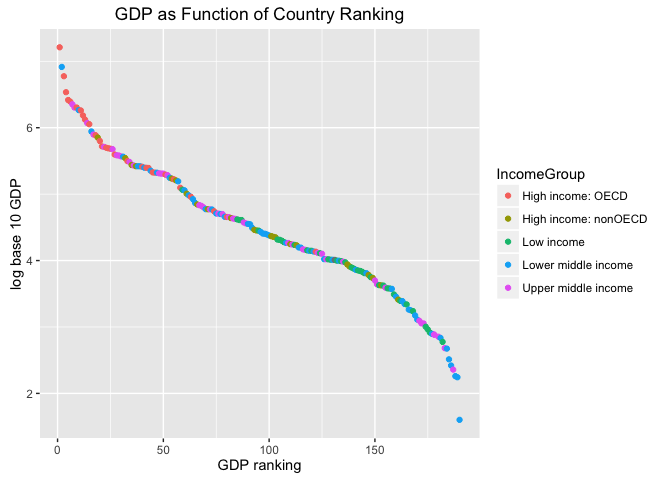

# Unit6CaseStudy_TidyData
Oscar Padilla  
June 13, 2016  


#CASE STUDY FOR UNIT 6
##Tidy Data
Let's start with the GDP file 


```r
library(repmis)
library(dplyr)
```

```
## 
## Attaching package: 'dplyr'
```

```
## The following objects are masked from 'package:stats':
## 
##     filter, lag
```

```
## The following objects are masked from 'package:base':
## 
##     intersect, setdiff, setequal, union
```

```r
library(ggplot2)
library(reshape2)
library(countrycode)
library(RCurl)
```

```
## Loading required package: bitops
```

```r
GDPurl <- "https://d396qusza40orc.cloudfront.net/getdata%2Fdata%2FGDP.csv"
rawGDP <- source_data(GDPurl, sep = ",", header = FALSE, stringsAsFactors = TRUE)
```

```
## Downloading data from: https://d396qusza40orc.cloudfront.net/getdata%2Fdata%2FGDP.csv
```

```
## SHA-1 hash of the downloaded data file is:
## 18dd2f9ca509a8ace7d8de3831a8f842124c533d
```

```
## Warning in fread(data, sep = sep, header = header, data.table = F,
## stringsAsFactors = stringsAsFactors, : Bumped column 6 to type character
## on data row 67, field contains 'a'. Coercing previously read values in this
## column from logical, integer or numeric back to character which may not
## be lossless; e.g., if '00' and '000' occurred before they will now be just
## '0', and there may be inconsistencies with treatment of ',,' and ',NA,' too
## (if they occurred in this column before the bump). If this matters please
## rerun and set 'colClasses' to 'character' for this column. Please note
## that column type detection uses the first 5 rows, the middle 5 rows and the
## last 5 rows, so hopefully this message should be very rare. If reporting to
## datatable-help, please rerun and include the output from verbose=TRUE.
```

```r
#Eliminate header and footer non-variable information
rawGDP <- rawGDP[6:195, ]
#Select only valid variables
GDPSelected <- dplyr::select(rawGDP, V1, V2, V4, V5)
#Rename variables to be human readable
names(GDPSelected) <- c("country_short", "rank", "country_long", "GDP2012")
#Look for NA values
GDPSelected[is.na(GDPSelected$GDP2012), ]
```

```
## [1] country_short rank          country_long  GDP2012      
## <0 rows> (or 0-length row.names)
```

```r
#Convert GDP into a numeric variable
GDPSelected$GDP2012 <- as.numeric(gsub(",", "", GDPSelected$GDP2012))
#Sort the data frame in ascending order by GDP (so United States is last). What is the 13th country in the resulting data frame
GDPclean <- arrange(GDPSelected, GDP2012)
GDPclean <- rename(GDPclean, CountryCode = country_short)
str(GDPclean)
```

```
## 'data.frame':	190 obs. of  4 variables:
##  $ CountryCode : Factor w/ 229 levels "","ABW","ADO",..: 209 107 135 164 189 70 205 53 43 224 ...
##  $ rank        : Factor w/ 196 levels "",".. Not available.",..: 103 101 100 99 98 97 96 95 94 93 ...
##  $ country_long: Factor w/ 230 levels "","Afghanistan",..: 213 106 133 159 201 137 207 56 44 172 ...
##  $ GDP2012     : num  40 175 182 228 263 326 472 480 596 684 ...
```

```r
#Top ten economies in descending order (largest economy first)
arrange(tail(GDPclean, 10), desc(GDP2012))
```

```
##    CountryCode rank       country_long  GDP2012
## 1          USA    1      United States 16244600
## 2          CHN    2              China  8227103
## 3          JPN    3              Japan  5959718
## 4          DEU    4            Germany  3428131
## 5          FRA    5             France  2612878
## 6          GBR    6     United Kingdom  2471784
## 7          BRA    7             Brazil  2252664
## 8          RUS    8 Russian Federation  2014775
## 9          ITA    9              Italy  2014670
## 10         IND   10              India  1841710
```

```r
#Last 13 countries by GDP size (smallest economy first)
head(GDPclean, 13)
```

```
##    CountryCode rank                   country_long GDP2012
## 1          TUV  190                         Tuvalu      40
## 2          KIR  189                       Kiribati     175
## 3          MHL  188               Marshall Islands     182
## 4          PLW  187                          Palau     228
## 5          STP  186    S\xe3o Tom\xe9 and Principe     263
## 6          FSM  185          Micronesia, Fed. Sts.     326
## 7          TON  184                          Tonga     472
## 8          DMA  183                       Dominica     480
## 9          COM  182                        Comoros     596
## 10         WSM  181                          Samoa     684
## 11         VCT  180 St. Vincent and the Grenadines     713
## 12         GRD  178                        Grenada     767
## 13         KNA  178            St. Kitts and Nevis     767
```
###2. Sort the data frame in ascending order by GDP rank (so United States is last). What is the 13th country in the resulting data frame?
*The 13th country is St. Kitts and Nevis with a GDP of $ 767 million USD.*

Let's move on to the educational data set.


```r
EduURL <- "https://d396qusza40orc.cloudfront.net/getdata%2Fdata%2FEDSTATS_Country.csv"
rawEdu <- source_data(EduURL, sep = ",", header = TRUE, stringsAsFactors = TRUE)
```

```
## Downloading data from: https://d396qusza40orc.cloudfront.net/getdata%2Fdata%2FEDSTATS_Country.csv
```

```
## SHA-1 hash of the downloaded data file is:
## 20be6ae8245b5a565a815c18a615a83c34745e5e
```

```r
#Select variables (columns) we actually need: first Country Code and third Income Group
EduSelected <- select(rawEdu, 1, 3)
names(EduSelected)[2] <- "IncomeGroup"
str(EduSelected)
```

```
## 'data.frame':	234 obs. of  2 variables:
##  $ CountryCode: Factor w/ 234 levels "ABW","ADO","AFG",..: 1 2 3 4 5 6 7 8 9 10 ...
##  $ IncomeGroup: Factor w/ 6 levels "","High income: OECD",..: 3 3 4 5 6 3 6 5 6 6 ...
```

Once we have cleaned up both files, let's proceed to merge both data sets.


```r
GDPEdu <- merge(GDPclean, EduSelected, by = "CountryCode", all = TRUE)
```

###1. Match the data based on the country shortcode. How many of the IDs match?
*However 45 countries are missing GDP data.* which will be eliminated.

###3. What are the average GDP rankings for the "High income: OECD" and "High income: nonOECD" groups?

```r
GDPEduSelected <- GDPEdu[!is.na(GDPEdu$GDP2012), ]
GDPEduclean <- arrange(GDPEduSelected, desc(GDP2012))
GDPEduclean$rank_num <- as.numeric(as.character(GDPEduclean$rank))
attach(GDPEduclean)
GDPEduclean[!is.na(GDPEduclean$IncomeGroup) & GDPEduclean$IncomeGroup == "High income: OECD", ]
```

```
##     CountryCode rank    country_long  GDP2012       IncomeGroup rank_num
## 1           USA    1   United States 16244600 High income: OECD        1
## 3           JPN    3           Japan  5959718 High income: OECD        3
## 4           DEU    4         Germany  3428131 High income: OECD        4
## 5           FRA    5          France  2612878 High income: OECD        5
## 6           GBR    6  United Kingdom  2471784 High income: OECD        6
## 9           ITA    9           Italy  2014670 High income: OECD        9
## 11          CAN   11          Canada  1821424 High income: OECD       11
## 12          AUS   12       Australia  1532408 High income: OECD       12
## 13          ESP   13           Spain  1322965 High income: OECD       13
## 15          KOR   15     Korea, Rep.  1129598 High income: OECD       15
## 18          NLD   18     Netherlands   770555 High income: OECD       18
## 20          CHE   20     Switzerland   631173 High income: OECD       20
## 21          SWE   21          Sweden   523806 High income: OECD       21
## 23          NOR   23          Norway   499667 High income: OECD       23
## 24          POL   24          Poland   489795 High income: OECD       24
## 25          BEL   25         Belgium   483262 High income: OECD       25
## 27          AUT   27         Austria   394708 High income: OECD       27
## 33          DNK   33         Denmark   314887 High income: OECD       33
## 40          ISR   40          Israel   258217 High income: OECD       40
## 42          GRC   42          Greece   249099 High income: OECD       42
## 43          FIN   43         Finland   247546 High income: OECD       43
## 45          PRT   45        Portugal   212274 High income: OECD       45
## 46          IRL   46         Ireland   210771 High income: OECD       46
## 51          CZE   51  Czech Republic   196446 High income: OECD       51
## 55          NZL   55     New Zealand   167347 High income: OECD       55
## 58          HUN   58         Hungary   124600 High income: OECD       58
## 63          SVK   63 Slovak Republic    91149 High income: OECD       63
## 74          LUX   74      Luxembourg    55178 High income: OECD       74
## 80          SVN   80        Slovenia    45279 High income: OECD       80
## 122         ISL  122         Iceland    13579 High income: OECD      122
```

```r
# Average GDP rankings for the "High income: OECD" 
mean(GDPEduclean[!is.na(GDPEduclean$IncomeGroup) & GDPEduclean$IncomeGroup == "High income: OECD", 6])
```

```
## [1] 32.96667
```


```r
GDPEduclean[!is.na(GDPEduclean$IncomeGroup) & GDPEduclean$IncomeGroup == "High income: nonOECD", ]
```

```
##     CountryCode rank         country_long GDP2012          IncomeGroup
## 19          SAU   19         Saudi Arabia  711050 High income: nonOECD
## 32          ARE   32 United Arab Emirates  348595 High income: nonOECD
## 35          SGP   35            Singapore  274701 High income: nonOECD
## 37          HKG   37 Hong Kong SAR, China  263259 High income: nonOECD
## 54          QAT   54                Qatar  171476 High income: nonOECD
## 56          KWT   56               Kuwait  160913 High income: nonOECD
## 61          PRI   61          Puerto Rico  101496 High income: nonOECD
## 66          OMN   66                 Oman   69972 High income: nonOECD
## 71          HRV   71              Croatia   59228 High income: nonOECD
## 82          MAC   82     Macao SAR, China   43582 High income: nonOECD
## 93          BHR   93              Bahrain   29044 High income: nonOECD
## 94          LVA   94               Latvia   28373 High income: nonOECD
## 101         TTO  101  Trinidad and Tobago   23320 High income: nonOECD
## 102         CYP  102               Cyprus   22767 High income: nonOECD
## 103         EST  103              Estonia   22390 High income: nonOECD
## 110         GNQ  110    Equatorial Guinea   17697 High income: nonOECD
## 113         BRN  113    Brunei Darussalam   16954 High income: nonOECD
## 137         MLT  137                Malta    8722 High income: nonOECD
## 138         BHS  138         Bahamas, The    8149 High income: nonOECD
## 147         MCO  147               Monaco    6075 High income: nonOECD
## 149         BMU  149              Bermuda    5474 High income: nonOECD
## 153         BRB  153             Barbados    4225 High income: nonOECD
## 161         ABW  161                Aruba    2584 High income: nonOECD
##     rank_num
## 19        19
## 32        32
## 35        35
## 37        37
## 54        54
## 56        56
## 61        61
## 66        66
## 71        71
## 82        82
## 93        93
## 94        94
## 101      101
## 102      102
## 103      103
## 110      110
## 113      113
## 137      137
## 138      138
## 147      147
## 149      149
## 153      153
## 161      161
```

```r
# Average GDP rankings for the "High income: nonOECD" 
mean(GDPEduclean[!is.na(GDPEduclean$IncomeGroup) & GDPEduclean$IncomeGroup == "High income: nonOECD", 6])
```

```
## [1] 91.91304
```

###4.	Plot the GDP for all of the countries. Use ggplot2 to color your plot by Income Group.

```r
plot(GDPEduclean$rank_num, log10(GDP2012))
```

<!-- -->

```r
ggplot(data = GDPEduclean, aes(x = rank_num, y = log10(GDP2012))) + geom_point(aes(col = IncomeGroup)) + labs(title = "GDP as Function of Country Ranking", x = "GDP ranking", y = "log base 10 GDP")+ scale_fill_manual(breaks = 50, 100, 150, 200, 250)
```

<!-- -->

